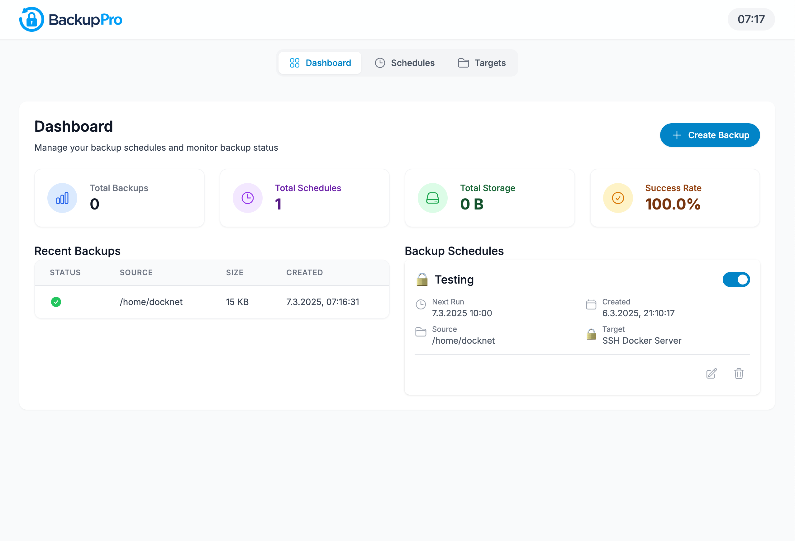

# BackupPro


[](LICENSE)

<div align="center">
  
</div>

> 💾 A modern backup scheduling application with support for various backup targets including local directories, SFTP, Dropbox, and Google Drive

## Screenshots

<div align="center">
  
  
  
  
</div>

_Left to right: Dashboard, Create Schedule, Backup Targets_

## Table of Contents
- [What is BackupPro?](#what-is-backuppro)
- [Features](#features)
- [Installation](#installation)
- [Configuration](#configuration)
- [Usage](#usage)
- [Troubleshooting](#troubleshooting)
- [Development](#development)
- [License](#license)

## What is BackupPro?
BackupPro is a comprehensive backup scheduling solution designed to simplify the process of creating, managing, and monitoring backups across various storage targets. With an intuitive web interface, it allows users to set up automated backup schedules, track backup status, and ensure data safety with minimal effort.

## Features

- 📅 **Flexible Scheduling**: Create backup schedules with customizable days and times
- 🎯 **Multiple Backup Targets**: Support for local directories, SFTP, SMB, Dropbox, and Google Drive
- 📊 **Dashboard Overview**: Monitor backup status, storage usage, and success rates at a glance
- 🔔 **Status Notifications**: Get informed about backup successes and failures
- 🔄 **Manual Backups**: Trigger immediate backups when needed
- 📁 **File Explorer**: Browse your file system to select backup sources
- 🌐 **Cloud Integration**: Connect to popular cloud storage services
- 🔒 **Secure Connections**: SFTP support with password or key-based authentication
- 🌙 **Dark Mode**: Eye-friendly interface for day and night use
- 🔍 **Detailed Logs**: Track all backup activities with comprehensive logs

## Installation

### Prerequisites

- Docker and Docker Compose
- Node.js (for development)

### Quick Start with Docker

1. Clone the repository:
   ```bash
   git clone https://github.com/yourusername/BackupPro.git
   cd BackupPro
   ```

2. Configure the application:
   ```bash
   cp .env.example .env
   # Edit the .env file to match your environment
   ```

3. Start the Docker containers:
   ```bash
   docker-compose up -d
   ```

4. Access the application at http://localhost:3000

## Configuration

BackupPro can be configured using environment variables in the `.env` file:

```
# Timezone settings
# Set your desired timezone here
TZ=Europe/Berlin

# Network settings
# Set your local IP address or hostname here
HOST_IP=192.168.2.86
# Ports for the different services
FRONTEND_PORT=3000
BACKEND_PORT=4000
POSTGRES_PORT=5432

# Database settings
POSTGRES_USER=postgres
POSTGRES_PASSWORD=postgres
POSTGRES_DB=backup_schedule

# Application settings
NODE_ENV=production
FILE_EXPLORER_BASE_DIR=/host_fs
```

### Timezone Configuration

The timezone setting (`TZ`) is used across all components (frontend, backend, and PostgreSQL) to ensure consistent time display and scheduling. Examples of valid timezones:

- `Europe/Berlin` (Germany)
- `Europe/London` (UK)
- `America/New_York` (US Eastern)
- `America/Los_Angeles` (US Pacific)
- `Asia/Tokyo` (Japan)

For a complete list of timezones, see [this reference](https://en.wikipedia.org/wiki/List_of_tz_database_time_zones).

### OAuth Configuration for Cloud Services

When adding cloud storage targets like Dropbox or Google Drive:

1. Navigate to "Targets" and click "Create New Target"
2. Select the target type (e.g., Dropbox or Google Drive)
3. Enter the required OAuth credentials (Client ID and Secret)
4. These credentials are securely stored in the database for future operations

## Usage

### Creating Backup Targets

1. Navigate to the "Targets" section
2. Click "Create New Target"
3. Select the target type (Local, SFTP, Dropbox, Google Drive)
4. Fill in the required information:
   - For local targets: Path to the backup destination
   - For SFTP: Server details, credentials, and path
   - For cloud services: Connect via OAuth

### Setting Up Backup Schedules

1. Go to the "Schedules" section
2. Click "Create Schedule"
3. Configure your schedule:
   - Name your backup schedule
   - Select the source directory to back up
   - Choose a backup target
   - Set the schedule (days of week and time)
   - Enable/disable the schedule as needed

### Monitoring Backups

The Dashboard provides an overview of:
- Total backups performed
- Active schedules
- Storage usage
- Success rate
- Recent backup status

Click on any metric for detailed information.

## Troubleshooting

### Common Issues

**Backup fails with "Permission denied"**
- Check that the application has read access to the source directory
- Verify write permissions on the target location

**Schedule not running at the expected time**
- Confirm the timezone setting in your `.env` file
- Check that the schedule is marked as "Active"
- Verify the server time with `docker-compose exec backend date`

**Cannot connect to cloud services**
- Ensure your OAuth credentials are correct
- Check your internet connection
- Verify that the service APIs are accessible from your server

### Logs

To view application logs:

```bash
# Backend logs
docker-compose logs backend

# Frontend logs
docker-compose logs frontend

# Database logs
docker-compose logs postgres
```

## Development

### Setting Up Development Environment

1. Clone the repository:
   ```bash
   git clone https://github.com/yourusername/BackupPro.git
   cd BackupPro
   ```

2. Install dependencies:
   ```bash
   # Frontend
   cd frontend
   npm install
   
   # Backend
   cd ../backend
   npm install
   ```

3. Start development servers:
   ```bash
   # Frontend
   cd frontend
   npm run dev
   
   # Backend
   cd ../backend
   npm run dev
   ```

### Project Structure

- `/frontend` - React.js frontend application
- `/backend` - Node.js backend API
- `/db` - Database migrations and seeds

## License

MIT

## Keywords
`backup` `scheduler` `automation` `data-protection` `cloud-backup` `sftp` 
`dropbox` `google-drive` `docker` `react` `node.js` `typescript` 
`postgresql` `backup-management` `web-interface` 